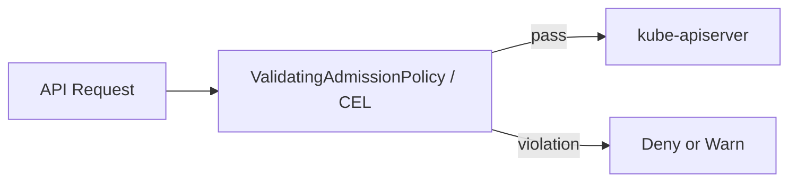
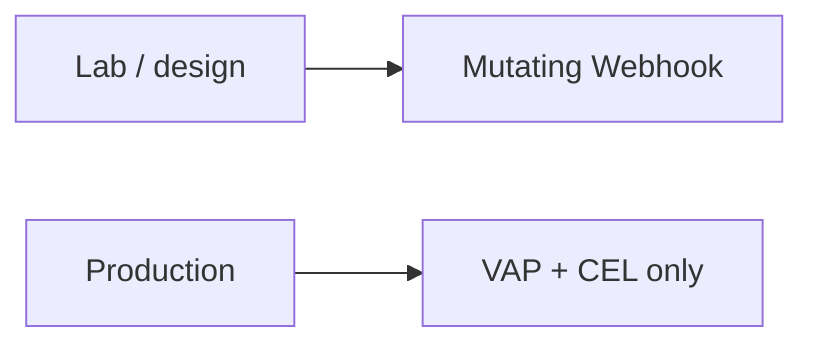

# Admission Policy Design / 운영 적용과 테스트 설계 구분

## Production

실제 운영 환경에는 `ValidatingAdmissionPolicy`와 CEL만 적용했습니다. Workload 생성/수정 요청을 API admission 시점에서 검증하고, Binding의 `validationActions`로 강제 수준을 관리했습니다.



## Exception handling

운영/테스트 중 정책에서 제외해야 하는 Namespace에는 명시적인 label을 사용했습니다.

```text
policy-exclude=true
```

예외를 CEL 안에 Namespace 이름으로 하드코딩하지 않고 label로 관리하면, 현재 예외 대상을 조회하고 테스트가 끝난 뒤 제거하기 쉽습니다.

## Admission Policy vs ResourceQuota

두 기능은 서로 다른 목적을 가집니다.

- Admission Policy: manifest가 플랫폼 정책을 만족하는지 검사
- ResourceQuota: Namespace에 허용된 리소스 총량을 초과하는지 검사

운영 테스트에서는 `--dry-run=server`를 통해 VAP 위반 여부를 확인했고, 실제 생성에서는 ResourceQuota에 의해 별도로 거부될 수 있음을 확인했습니다.

## Test design only — Mutating Webhook

Namespace label 자동 주입처럼 object mutation이 필요한 요구는 별도의 Mutating Webhook 설계로 검토했습니다. 다만 이 Webhook은 실제 고객 운영 환경에는 적용하지 않았습니다.



이 문서는 Production 경험과 테스트 설계를 섞지 않기 위해 두 범위를 명시적으로 분리합니다.
