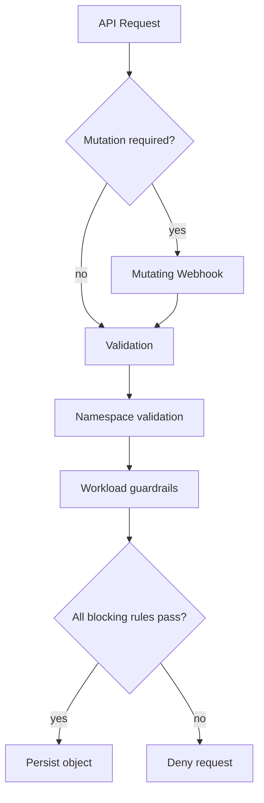

# Policy Design Summary

**Artifact type:** DESIGN SUMMARY - derived from the supplied Kubernetes Admission Policy design document.

## Scope

Target workload types:

- Namespace
- Deployment
- StatefulSet
- DaemonSet

The design uses stable `admissionregistration.k8s.io/v1` ValidatingAdmissionPolicy for validation and a mutating webhook where object mutation is required.

## Why validation and mutation are separated

ValidatingAdmissionPolicy can decide whether a request passes and can return warnings, but it does not mutate the admitted object. A requirement to inject a missing label therefore belongs in a mutating admission mechanism.

The design explicitly avoided relying on an alpha native mutation feature where control-plane feature-gate management was not practical in the managed platform.

## Example policy requirements from the source design

| Target | Condition | Action | Mechanism |
|---|---|---|---|
| Namespace | required network label missing | Deny | VAP |
| Namespace | Pod Security label missing | inject default | Mutating webhook |
| Namespace | ingress/network label absent | Warn | VAP |
| Deployment/StatefulSet/DaemonSet | SA token auto-mount policy violated | Deny | VAP |
| Deployment/StatefulSet/DaemonSet | CPU/memory resources missing | Deny or Warn depending on container type | VAP |

## Admission flow

## Operational design points

- system namespaces should be protected from accidental policy targeting
- `failurePolicy` should be selected according to the risk of fail-open vs fail-closed behavior
- VAP `status.typeChecking` should be checked after policy installation
- rollout should begin in observation/warning mode before broad Deny enforcement when possible
- existing objects are not automatically remediated; CREATE/UPDATE is the enforcement point

## Source-code boundary

Only the supplied workload VAP is included as executable YAML. Namespace-policy and mutating-webhook code referenced by the design document should be added later if the original sanitized source can be collected.
