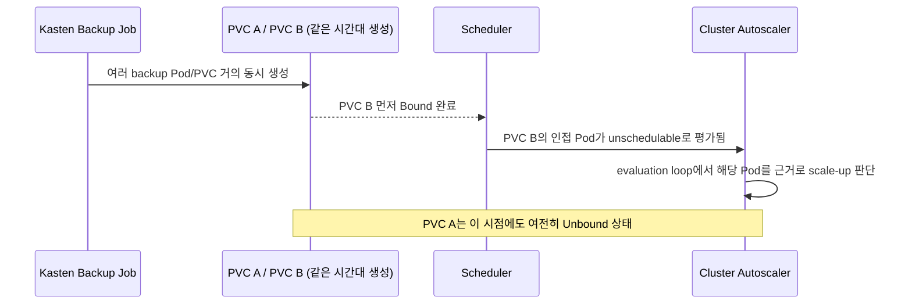

# Cluster Autoscaler Unexpected Scale-out — PVC Binding Race RCA

**Artifact type:** SANITIZED PRODUCTION RCA

## Context

사전 기능 검증([HPA + Cluster Autoscaler Validation](09_test_scenario_runbook.md)) 이후 실제 고객사 Kubernetes 환경에 Cluster Autoscaler를 설치했습니다. 설치 이후 애플리케이션 부하 증가 없이 node가 추가로 scale-out되는 현상이 관측되어 별도로 RCA했습니다.

## Symptoms

- Kasten K10 backup workload가 실행되는 시간대에 예상하지 못한 node scale-out이 발생했습니다.
- 같은 시간대 HPA target/replica 지표는 특별히 증가하지 않았습니다.
- backup 작업이 끝난 뒤 추가된 node는 다시 scale-down됐습니다.

## Initial hypothesis — 기각

처음에는 backup 대상 PVC를 가진 Pod가 일시적으로 Pending/Unbound 상태가 되었고, 이 Pod가 Cluster Autoscaler의 scale-out을 직접 트리거했다고 의심했습니다. 이 가설은 이후 timeline 비교에서 기각했습니다.

## Investigation

- Kasten backup 작업 시점과 node scale-out 발생 시점이 겹친다는 것을 먼저 확인했습니다.
- 같은 시간대에 여러 backup 관련 Pod와 PVC가 거의 동시에 생성되고 있었습니다.
- Pod별 Kubernetes Event, PVC의 Phase/Binding timestamp, Cluster Autoscaler 로그(scale-up decision)를 같은 timeline 위에 정렬해 비교했습니다.

## Root cause

실제 scale-up trigger는 처음에 Pending으로 관측된 Unbound PVC Pod가 아니라, **PVC binding이 먼저 완료된 인접 Pod**였습니다. 여러 backup Pod/PVC가 거의 동시에 생성되는 상황에서 storage binding이 완료되는 타이밍과 Cluster Autoscaler evaluation loop가 맞물리면서, 실제로 scale-out을 유발한 Pod와 처음 관찰된 Pending/Unbound Pod가 서로 다른 race/timing condition으로 분석했습니다.

## Resolution

- Backup용 StorageClass의 `volumeBindingMode`를 `Immediate`에서 `WaitForFirstConsumer`로 변경했습니다.
- Cluster Autoscaler에 `new-pod-scale-up-delay`를 적용했습니다.
- RCA 절차에 Pod Event + PVC Phase/Binding timestamp + CA scale-up decision을 같은 timeline으로 비교하는 단계를 표준 절차로 추가했습니다.

## Validation

- 변경 이후 동일한 backup 시간대의 node scale-out 여부를 관찰했습니다.
- StorageClass 변경이 다른 backup/워크로드 동작에 영향을 주지 않는지 확인했습니다.

## Engineering lesson

Cluster Autoscaler 이벤트만 보고 "어떤 Pod가 Pending이었는가"로 원인을 단정하면 틀릴 수 있습니다. 비슷한 시간에 여러 Pod/PVC가 함께 생성되는 상황에서는 Pending Pod의 존재 자체가 아니라, scheduler와 CA evaluation loop가 실제로 어떤 Pod를 근거로 판단했는지를 timestamp 단위로 확인해야 합니다.
