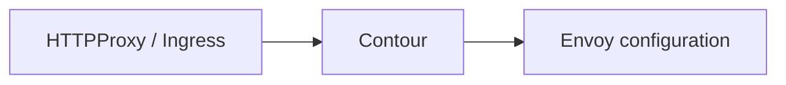
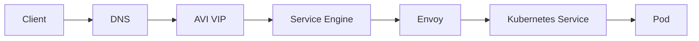
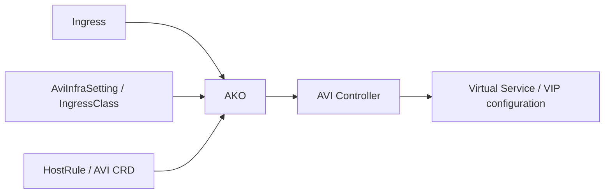
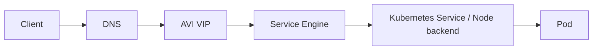

# Control Plane vs Data Plane

The public diagram deliberately separates control-plane configuration from runtime traffic.

## AS-IS - Contour / HTTPProxy model

### Control plane

### Data plane

## TO-BE - AKO / AVI Ingress model

### Control plane

### Data plane

## Why this separation matters

AKO and Contour are controllers. They configure the data-plane components but are not normally inline hops for every application packet. Showing control plane and data plane separately makes the portfolio architecture easier to defend technically.
